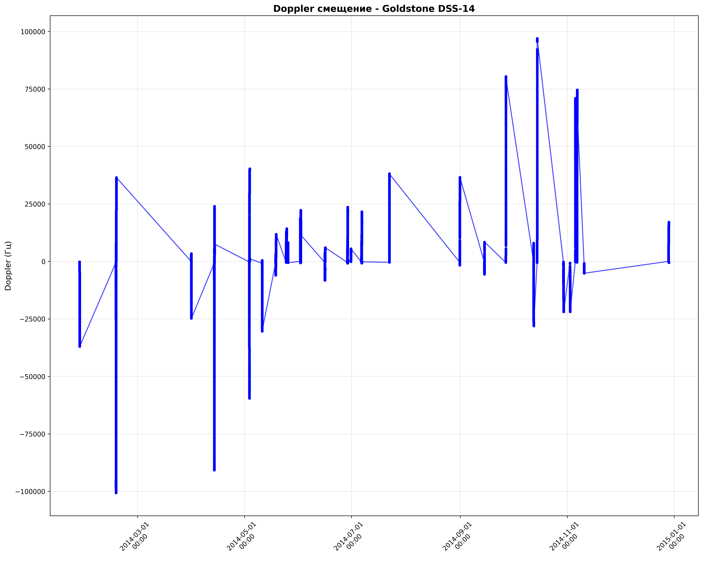
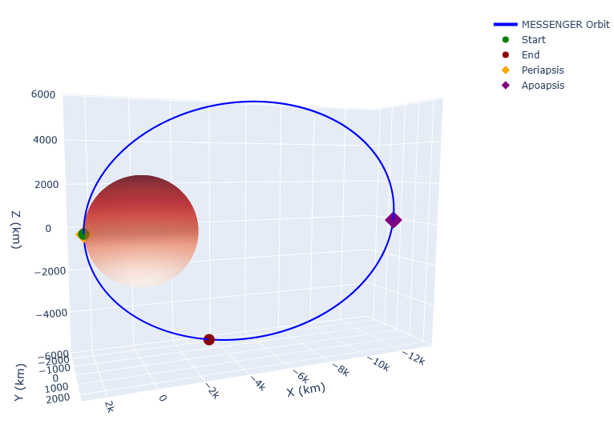
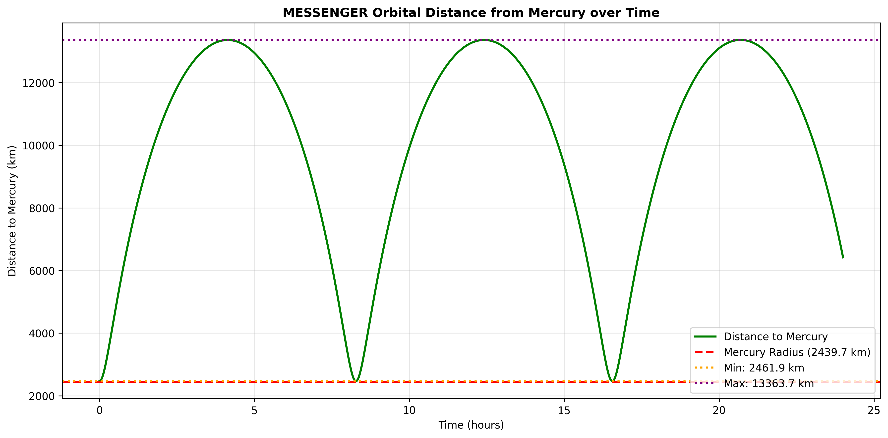
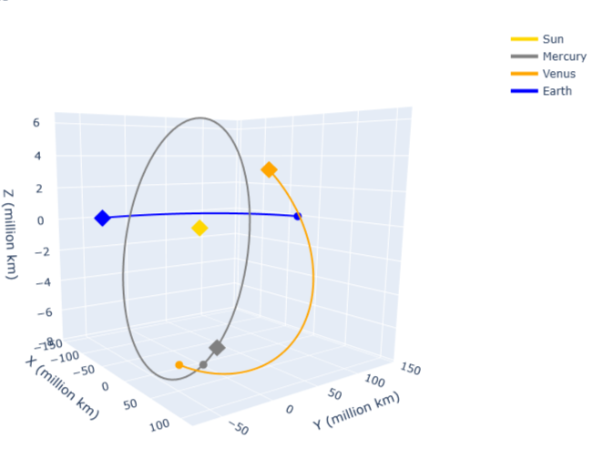
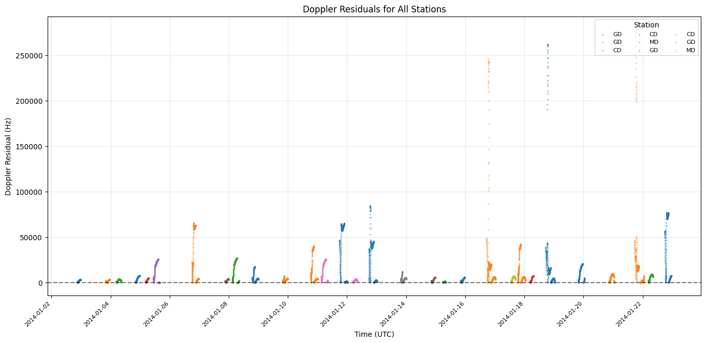
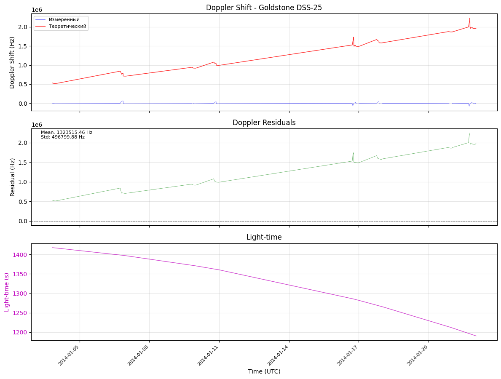
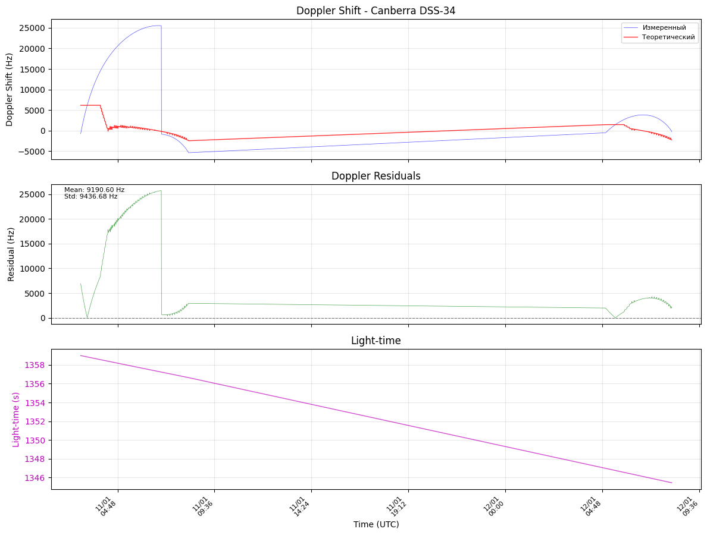
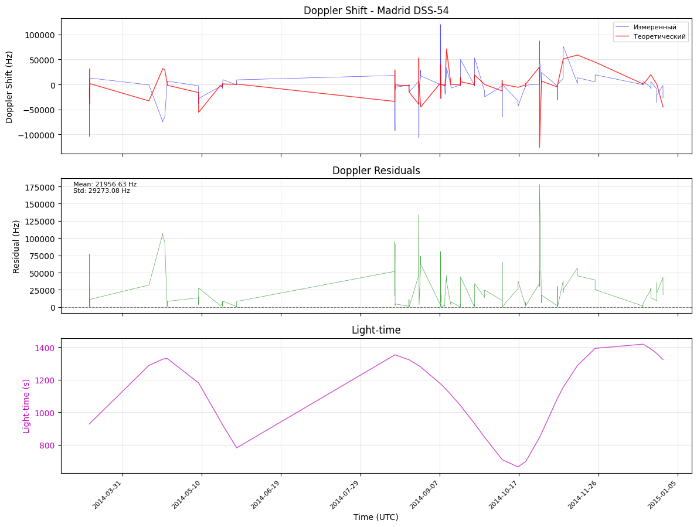

## [Таблица с заданием и положением дел](https://docs.google.com/spreadsheets/d/1PiWMP1UAox0SyNpW9YoAOpx2_R84qDdb68PuRcVVy04/edit?gid=0#gid=0)
### <br>
## Наше задание:
Уточнение орбиты КА


Сайт с наблюдаемыми величинами для всех КА [здесь](https://pds-geosciences.wustl.edu/dataserv/radio_science.htm). Вам нужны данные из файлов ODF.
[Данные](https://pds-geosciences.wustl.edu/messenger/urn-nasa-pds-mess-rs-raw/data-odf/) MESSENGER

Обратите внимание, что некоторые данные в формате PDS4, а некоторые в PDS3.
Для чтения PDS4 есть библиотека [pds4_tools](https://pypi.org/project/pds4-tools/) на питоне, для PDS3 должна работать следующая [библиотека](https://pdr.readthedocs.io/en/stable/).

Для решения прямой задачи см. тему первой работы прошлого семестра про задачу N тел. Здесь вам нужно моделировать движение лишь одного тела (космического аппарата), положения всех остальных возмущающих тел вам известны либо с сайта [EPM](https://iaaras.ru/en/dept/ephemeris/online/), либо с сайта [JPL Horizons](https://ssd.jpl.nasa.gov/horizons/app.html). Можно скачать Vector Table для возмущающих тел (Солнце, Земля и др.) за определенный промежуток времени, интерполировать их и знать положения и скорости этих тел в нужные вам моменты времени.


Для решения обратной задачи вашими путеводителями будут [книга](https://descanso.jpl.nasa.gov/monograph/series2/Descanso2_all.pdf) “Formulation for Observed and Computed Values of Deep Space Network Data Types for Navigation” Moyer (2003) и аспирантская [работа](https://theses.hal.science/tel-01124331v1/file/2013BESA2030.pdf) Verma. Verma иногда более простым языком объясняет нужные вещи, но почти все важные для вас вещи он берет из Moyer.

В Verma и Moyer вам будет интересно то, как из файлов ODF получить Ramped Two-way Doppler Shift и как получить Two-way Range. Также вам нужно решить уравнение Light-Time.


После того, как вы построите орбиту КА и научитесь получать наблюдаемую и вычисляемую величину вам надо реализовать метод наименьших квадратов.
### <br>
## План работ по задаче:

- [x] Научиться читать данные с ODF файлов. Прочитать пункт в Verma про ODF файл, понять как вам получить наблюдаемые величины.

- [x] Решить прямую задачу (можно уравнение Ньютона без релятивистики). Научиться интерполировать орбиты возмущающих тел (планет).

- [ ] Получить вычисляемые величины по полученной орбите. (Решение Light-Time, вычисление Ramped Two-way Doppler Shift или Two-way Range).

- [ ] Метод наименьших квадратов
### <br>

## Материалы:
* [Входные данные по статье Verma](ODF_data.pdf)
* [Light-Time и Ramped-Two-Way-Doppler (из статьи Verma)](Light-Time+Two-way-Doppler.pdf)
* [Короткая статья почти прям по прямой задаче и для орбиты MESSENGER](%D0%B2%D0%B5%D0%BB%D0%B8%D0%BA%D0%BE%D0%BB%D0%B5%D0%BF%D0%BD%D0%B0%D1%8F_%D0%BA%D0%BD%D0%B8%D0%B3%D0%B0.pdf)
* [Конкретные формулы для обратной задачи с практики](%D0%92%D0%B0%D0%B6%D0%BD%D0%BE%D0%B5.pdf)
* [Общие материалы с практики](%D0%9E%D1%81%D1%82%D0%B0%D0%BB%D1%8C%D0%BD%D0%BE%D0%B5.pdf)
* [Книга](https://descanso.jpl.nasa.gov/monograph/series2/Descanso2_all.pdf)
<br>
<br>
<br>
<br>

## Запуск проекта:
```
unzip raw_messenger_doppler_data.zip
```
```
unzip horizons_data/horizons_results_all.zip -d ./horizons_data
```
```
python -m venv env
source env/bin/activate
pip install -r requirements.txt
```
```
python main.py
```
<br>
<br>

## Результаты:
### Сдвиг частоты

<br>

### Орбита КА

<br>

### Амплитуда КА

<br>

### Орбиты других тел за рассматриваемый период


### Расхождения в прямой задаче: (первые 100000 записей)

<br>

<br>

<br>


